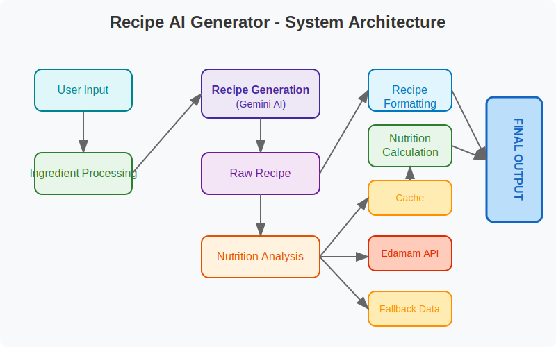
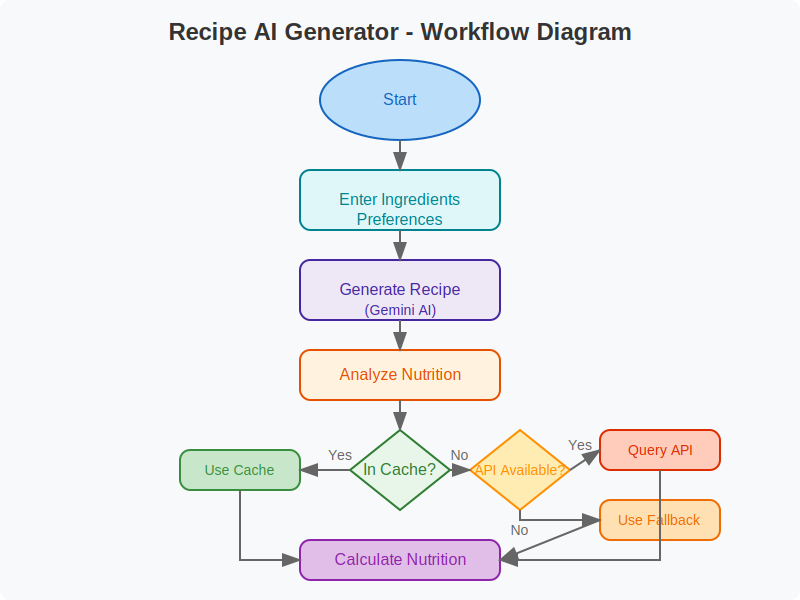

# Recipe AI Generator Documentation

## 📋 Project Overview
The Recipe AI Generator is a Kaggle notebook that creates personalized recipes based on user-provided ingredients and dietary preferences. The system leverages:

- **Google's Gemini AI** for intelligent recipe generation
- **Edamam API** (with fallback options) for comprehensive nutrition analysis
- **Interactive interface** for easy user engagement

The final output includes complete recipes with detailed nutrition information and visualizations.

---

## 🛠️ Setup Requirements

### API Keys
- **Required**: Google Gemini API Key
- **Optional**: Edamam API (App ID and App Key) for enhanced nutrition data

### Adding API Keys to Kaggle
1. Navigate to Kaggle account settings
2. Access the "Secrets" section
3. Add the following secrets:
   - `GOOGLE_API_KEY`: Your Gemini API key
   - `EDAMAM_APP_ID`: Your Edamam App ID (optional)
   - `EDAMAM_APP_KEY`: Your Edamam App Key (optional)

### Required Libraries
- google.generativeai
- requests
- json
- re
- pandas
- matplotlib
- seaborn
- ipywidgets

---

## 🧩 System Architecture

The system architecture diagram illustrates how different components interact:
1. User provides ingredients and preferences
2. Ingredients are processed to extract key terms
3. Gemini AI generates recipe based on processed input
4. Raw recipe is processed for formatting
5. Nutrition analysis is performed using cached data, Edamam API, or fallback data
6. Nutrition calculations are performed
7. Final output combines formatted recipe and nutrition information

---

## 📊 Code Documentation

| Cell | Purpose | Description |
|------|---------|-------------|
| 1 | Import Libraries | Sets up all necessary dependencies for API interactions, data processing, visualization, and interface components |
| 2 | Configure Gemini API | Retrieves and configures the Google Gemini API using the key stored in Kaggle secrets |
| 3 | Initialize Variables | Sets up nutrition data cache and fallback values for common ingredients |
| 4 | Ingredient Processing | Extracts main ingredients from complex descriptions to improve nutrition lookup accuracy |
| 5 | Nutrition Data Retrieval | Implements a layered approach to fetch nutrition data from cache, fallback data, or Edamam API |
| 6 | Nutrition Calculation | Processes ingredient data to calculate total and per-serving nutritional values |
| 7 | Recipe Generation | Core function that uses Gemini AI with few-shot prompting to create recipes |
| 8 | Display Functions | Creates visualizations and formatted displays for recipes and nutrition information |
| 9 | Main Function | Orchestrates the entire recipe generation process and workflow |
| 10 | Interactive UI | Creates user interface with widgets for ingredient input and preference selection |
| 11 | App Execution | Entry point that launches the interactive application |

---

## 📱 Usage Guide

### Basic Operation
1. Run all notebook cells sequentially
2. Wait for the interactive widget interface to appear
3. Enter ingredients separated by commas (e.g., "chicken, broccoli, rice")
4. Adjust serving size using the slider
5. Select any applicable dietary preferences
6. Click "Generate Recipe" button
7. View the generated recipe, nutrition information, and visualization

### Saving Recipes
- Check the "Save Recipe as JSON" option before generating
- Files are saved in the notebook directory with timestamps

### Example Input/Output

**Input:**
- Ingredients: chicken, broccoli, rice
- Servings: 3
- Dietary Preferences: Low Sodium

**Output:**
- Complete recipe with name, ingredients, and instructions
- Nutrition facts per serving
- Macronutrient distribution chart
- Raw JSON data (collapsible)

---

## 🔌 API Integration

### Google Gemini API
- Powers AI recipe generation
- Uses few-shot prompting with examples
- Requires API key in Kaggle secrets

### Edamam Nutrition API
- Retrieves comprehensive nutrition data
- Optional with fallback system
- Requires App ID and App Key in Kaggle secrets

---

## ❓ Troubleshooting

### Common Issues

| Issue | Cause | Solution |
|-------|-------|----------|
| "Error configuring Gemini API" | Missing/incorrect API key | Verify Gemini API key in Kaggle secrets |
| "Failed to generate recipe" | API connection or invalid input | Check internet connection and ingredient format |
| Poor nutrition data quality | Missing Edamam API or unusual ingredients | Add Edamam API keys or use common ingredient names |
| Widget display issues | Kaggle environment limitations | Restart kernel and run all cells sequentially |

### Performance Tips
- The nutrition cache system reduces API calls for repeated ingredients
- Use common ingredient names for better nutrition data matching
- Consider limiting the number of ingredients for faster generation

---

## 🔄 Workflow Diagram

The workflow diagram details the recipe generation process:
1. User initiates the process
2. Ingredients and preferences are entered
3. Recipe is generated via Gemini AI
4. Nutrition analysis begins
5. System checks if ingredients are in cache
   - If yes, cached data is used
   - If no, system checks for Edamam API availability
      - If available, API is queried
      - If unavailable, fallback data is used
6. Nutrition calculations are performed
7. Final recipe with nutrition information is displayed

---

*Last Updated: April 19, 2025*
